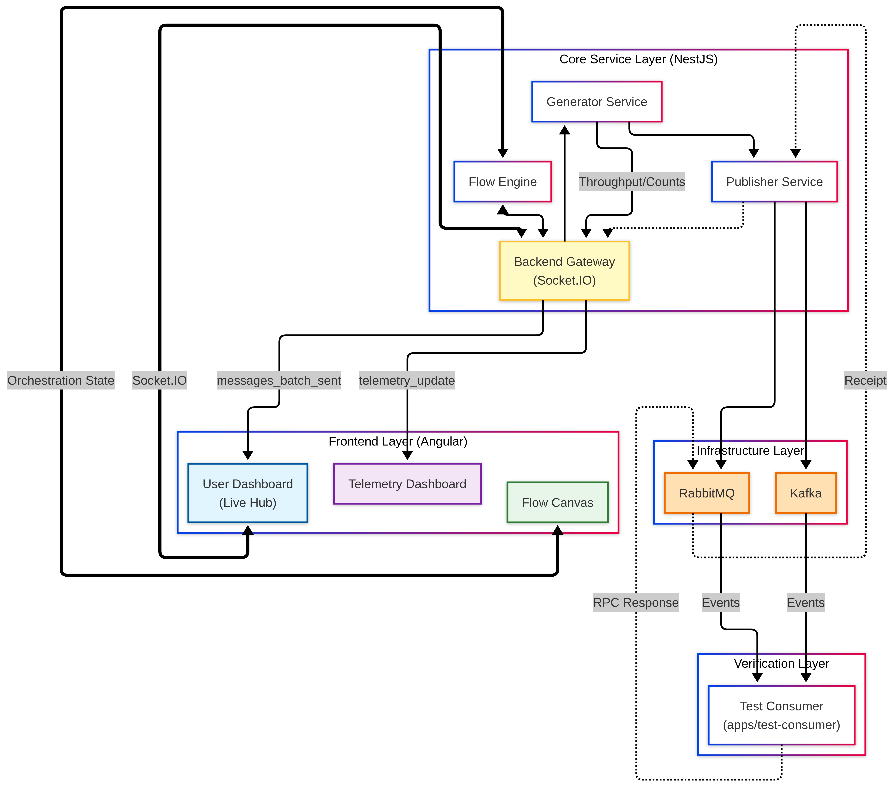

# Machine Gun

[](https://www.rabbitmq.com/)
[](https://kafka.apache.org/)
[](https://nestjs.com/)
[](https://angular.dev/)
[](https://www.typescriptlang.org/)
[](https://www.docker.com/)
[](https://turbo.build/repo)
[](https://pnpm.io/)

[](https://tailwindcss.com/)
[](https://www.chartjs.org/)
[](https://github.com/dagrejs/dagre)
[](https://vitest.dev/)
[](https://eslint.org/)
[](https://prettier.io/)
[](https://piscinajs.dev)
[](https://mathjs.org/)
[](https://fakerjs.dev/)

A performance-focused load testing tool and event simulator for RabbitMQ and Kafka. It lets you define message schemas, generate realistic payloads at high velocity, and orchestrate complex testing flows.


## What it does

- Define and store nested message schemas.
- High-velocity generation (100k+ msg/s) using worker threads.
- Supports RabbitMQ and Kafka with drift-corrected rate limiting.
- Automatic infrastructure setup for RabbitMQ (queues/exchanges).
- Graph-based orchestration for complex simulation flows.
- Real-time activity monitoring and RPC response tracking via the Live Hub.

## Architecture




## Monorepo structure

- `apps/backend` — NestJS + Fastify API/WebSocket server with multi-threaded generation and flow orchestration.
- `apps/frontend` — Angular 21 dashboard with signal-based state and premium orchestration controls.
- `apps/test-consumer` — High-coverage test app for RabbitMQ (RPC, TTL, Priority, Auto-delete) and Kafka verification.
- `packages/common` — Shared TypeScript contracts and utilities (`@machine-gun/common`).

## Prerequisites

- Node.js `22+`
- pnpm `10+`
- RabbitMQ reachable from backend (`RABBIT`)
- Kafka optional (`KAFKA`)

## Quick start

```bash
pnpm install
pnpm dev
```

`pnpm dev` now starts the backend, frontend, and the test-consumer app through Turborepo.

Useful scoped commands:

- Frontend only: `pnpm dev:ui`
- Backend only: `pnpm dev:api`
- Test consumer only: `pnpm dev:test-consumer`
- Full build: `pnpm build`
- Full test suite: `pnpm test`

## Docker compose

The root compose file runs the full local stack:

```bash
docker compose up --build
```

Services exposed on the host:
### 🐳 Docker (Quick Start)

The easiest way to run Machine Gun is using the unified Docker image which contains both the UI and the API.

```bash
docker compose up --build -d
```

Access the UI at `http://localhost:3000`.

### 🛠 Local Development

1. Start backend and frontend.
2. Open the UI at `http://localhost:4200`.
3. Create or import schemas.
4. Run burst/continuous tests or start a flow from the canvas.
5. Monitor transport health, throughput, node states, and RPC responses in real time.

## Testing

- Backend tests: `pnpm --filter backend test`
- Frontend tests: `pnpm --filter frontend test`
- Workspace tests: `pnpm test`
- **Coverage (All apps)**: `pnpm test:coverage` (Automatically opens HTML reports in your browser)

## Tech stack

- **Backend:** NestJS 11, Fastify, Socket.IO, RabbitMQ, KafkaJS, Piscina.
- **Frontend:** Angular 21, Signals, Tailwind CSS 4, Chart.js, Dagre.
- **Performance:** Multi-threaded generation with drift correction.
- **Tooling:** pnpm, Turborepo, Vitest, TypeScript.


## Internal Documentation

- Backend details: [`apps/backend/README.md`](apps/backend/README.md)
- Frontend details: [`apps/frontend/README.md`](apps/frontend/README.md)
- Test Consumer details: [`apps/test-consumer/README.md`](apps/test-consumer/README.md)

## License

Apache 2.0 — see [`LICENSE`](LICENSE).
